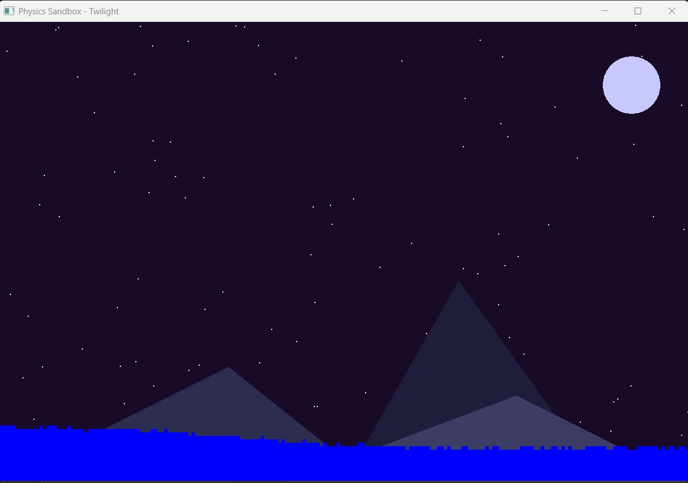
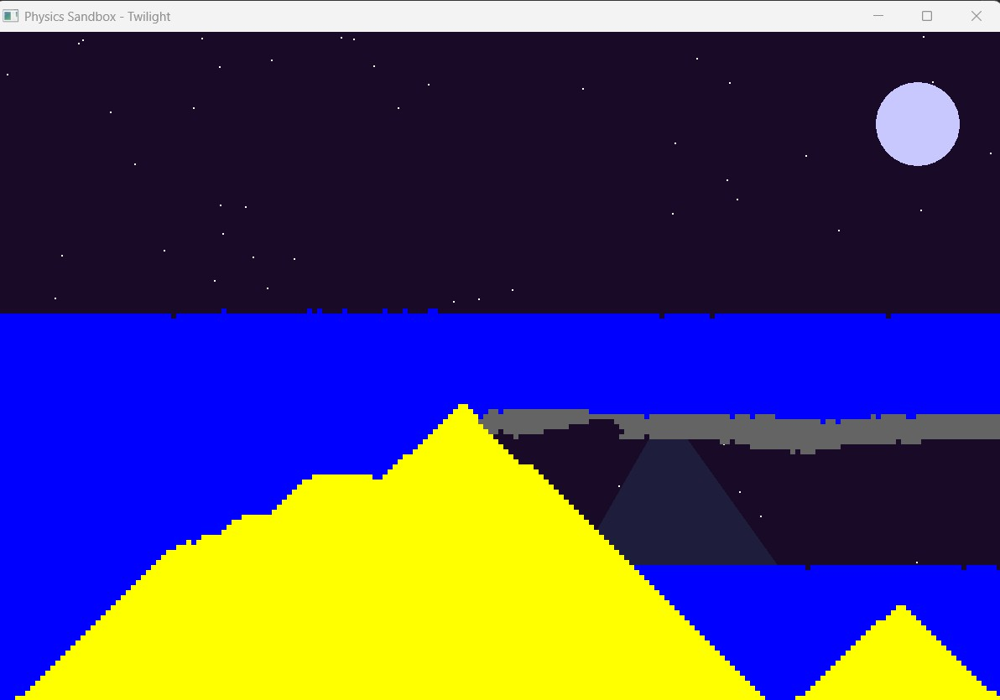

# 🌌 Physics Sandbox – SFML Particle Playground

A small but polished **2D physics sandbox** written in modern C++ and **SFML 3**.  
Draw sand, water, stone and snow into a twilight mountain scene and watch them fall,
flow and stack in a simple particle simulation.

This project started as a learning playground for C++ and graphics, and evolved into
a neat little demo you can actually play with.

---

## ✨ Features

- **Particle types**
  - 🟡 `Sand` – falls down, piles up, sinks through water  
  - 🔵 `Water` – flows down and sideways like a liquid  
  - ⚪ `Snow` – similar to sand but with a different visual feel  
  - ⚫ `Stone` – solid, does not move

- **Simple falling-sand physics**
  - Grid–based world using a 1D `std::vector<CellType>`
  - Bottom–up update loop to avoid “double movement” in a single frame
  - Sand/snow can **sink into water** (heavier than liquid)

- **Brush-based drawing**
  - Circular brush with configurable radius  
  - Left mouse button → paint the selected material  
  - Right mouse button → erase (set to `EMPTY`)

- **Twilight background scene**
  - Night-sky color with a soft twilight feel
  - Randomly scattered stars
  - Moon and layered mountains built from SFML shapes

- **Clean separation of logic**
  - `World` – particle storage + physics update + rendering
  - `Brush` – brush radius, mode (paint/erase), preview rendering

---

## 🎮 Controls

| Input                     | Action                                   |
|---------------------------|------------------------------------------|
| `1`                       | Select **Sand**                          |
| `2`                       | Select **Water**                         |
| `3`                       | Select **Stone**                         |
| `4`                       | Select **Snow**                          |
| `+` / `=`                 | Increase brush radius                    |
| `-` / `_`                 | Decrease brush radius                    |
| Left Mouse Button         | Paint using current material             |
| Right Mouse Button        | Erase (set cells to `EMPTY`)            |
| `R`                       | Reset world (clear all particles)       |
| Window close button (X)   | Exit                                    |

---

## 📸 Screenshots

> Place your screenshots inside `assets/screenshots/` (or any path you like)
> and update the file names below if needed.

<p align="center">
  
</p>
<p align="center">
  
</p>


---

## 🧱 Project Structure

```text
Physics-Sandbox/
├─ src/
│  ├─ main.cpp          # Game loop, input, background rendering
│  ├─ World.hpp/cpp     # World grid, physics update, particle rendering
│  ├─ Brush.hpp/cpp     # Brush radius, paint/erase, preview circle
│  ├─ Constants.hpp     # Window size, cell size, grid dimensions
│  └─ ...               # (Visual Studio project files, etc.)
├─ assets/
│  └─ screenshots/      # .png screenshots referenced in this README
└─ README.md
```

> The world uses a simple 2D grid mapped into a 1D vector:
> `index = y * COLUMNS + x`, which keeps the data cache–friendly and easy to reason about.

---

## 🛠️ Technologies

- **Language:** Modern C++ (C++17/C++20)
- **Graphics / Windowing:** [SFML 3.x](https://www.sfml-dev.org/)  
- **Platform:** Windows (tested with Visual Studio)

---

## 🚀 Getting Started

> These are generic steps for Windows + Visual Studio.  
> Adjust paths and versions according to your local SFML installation.

1. **Clone the repository**

   ```bash
   git clone https://github.com/<your-username>/Physics-Sandbox.git
   cd Physics-Sandbox
   ```

2. **Install SFML 3**

   - Download SFML 3.x for Windows (MSVC)  
   - Extract it somewhere like `C:\SFML-3.0.2`

3. **Configure include & lib paths in Visual Studio**

   In your project settings:

   - **C/C++ → Additional Include Directories**  
     - `C:\SFML-3.0.2\include`
   - **Linker → Additional Library Directories**  
     - `C:\SFML-3.0.2\lib`

   Link against at least:

   - `sfml-graphics`
   - `sfml-window`
   - `sfml-system`

4. **Build & run**

   - Set the configuration to `Debug` or `Release`
   - Press `F5` (or run from the IDE)
   - Draw some sand and water and enjoy 🌙

---

## 🧠 What this project demonstrates

- Using **SFML 3**’s new API (e.g. `std::optional<sf::Event>`, `setPosition({x, y})`)
- Basic **game loop structure** (update → draw → display)
- Simple **cell-based physics** and update ordering
- Splitting responsibilities into small, focused C++ classes

---

## 🗺️ Possible Extensions

Some ideas for future improvements:

- HUD overlay with current material, brush size and controls
- Sound effects when placing/erasing particles
- More materials (lava, oil, gas, acid…)
- Saving & loading “scenes”
- Simple main menu / pause screen

---

## 📚 License

This project is released under the MIT License.  
Feel free to experiment, modify and learn from it.
